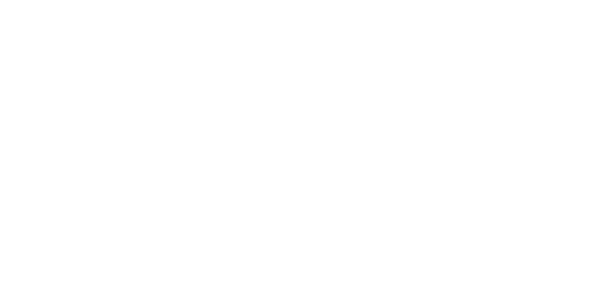

[FR](#fr) | [EN](#en)

## FR

**ToolBox** est un utilitaire modulaire permettant d'utiliser de petits scripts de manière simple et efficace.

### Pourquoi ToolBox ?
Les petits scripts Python peuvent être très utiles pour automatiser des tâches simples, comme convertir une image de PNG à ICO. Cependant, ces scripts sont souvent isolés et ne peuvent gérer qu'une tâche à la fois, rendant leur utilisation parfois limitée. 

**ToolBox** change la donne en offrant une solution centralisée et modulaire. Vous pouvez regrouper ces scripts en un seul utilitaire, les installer facilement, et les exécuter en un rien de temps.

### Exemple :
Vous avez un script Python pour changer le format d'une image ? Avec **ToolBox**, vous pouvez l'installer en une ligne :
```bash
toolbox install /chemin/vers/votre_script.py
```

Une fois installé, votre script est prêt à être utilisé via l'interface de **ToolBox**, et vous pouvez ainsi gérer facilement tous vos petits outils en un seul endroit.

### Pourquoi ne pas utiliser un outil en ligne ?
- **Sécurité et confidentialité** : Les outils en ligne collectent souvent des données sur leurs utilisateurs, et il peut être difficile de savoir comment vos informations sont utilisées. **ToolBox** fonctionne localement sur votre machine, garantissant que vos données restent privées.
- **Fiabilité** : Pas besoin d'une connexion Internet pour que cela fonctionne. **ToolBox** est toujours accessible, même hors ligne.
- **Personnalisation** : Créez vos propres scripts ou téléchargez ceux des autres et adaptez-les à vos besoins.

### Installation deb :
1. Téléchargez le fichier `.deb` :
    1. Aller dans Realeases -->
    2. Prenez la dernière en date.
    3. Télécharger le fichier correspondant a votre OS
2. Installez **ToolBox** (Linux):
    ```bash
    sudo dpkg -i ToolBox.deb
    ```

### Build

1. Clonez le repo
    ```bash
    git clone https://github.com/Lasertie/ToolBox.git
    ```
2. ```bash
    ./build.bash 
    ```
    
---

## EN

**Coming soon**
